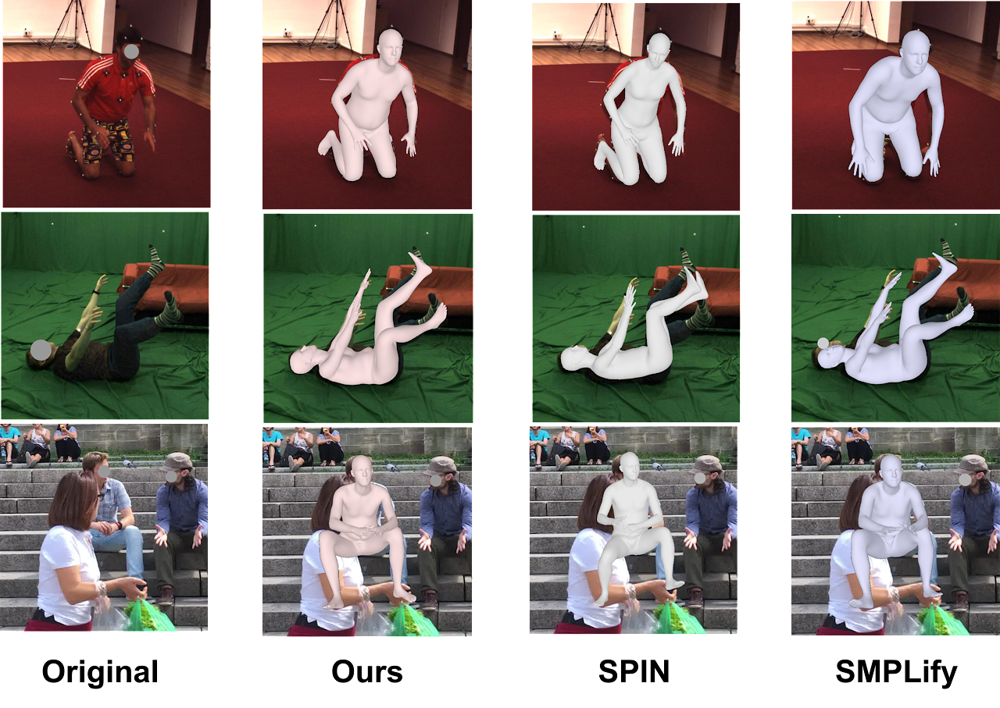

# Reviatalizing Optimization for 3D Human Pose and Shape Estimation: A Sparse Constrained Formulation

This is the implementation of the approach described in the paper:
> Taosha Fan, Kalyan Vasudev Alwala, Donglai Xiang, Weipeng Xu, Todd Murphey, Mustafa Mukadam. [Reviatalizing Optimization for 3D Human Pose and Shape Estimation: A Sparse Constrained Formulation](https://arxiv.org/abs/2105.13965). In IEEE/CVF International Conference on Computer Vision (ICCV), 2021.

More demos are available at https://sites.google.com/view/scope-human

<p align="center"></p>

## Install
```shell
git clone https://github.com/fantaosha/SCOPE.git
cd SCOPE
export SCOPE_ROOT=$(pwd)
mkdir build
cd build
cmake ../C++
make -j4
```

## Usage

### SMPL Model
Download the [SMPL model](https://smpl.is.tue.mpg.de/) and extract these```.pkl``` files to [```SCOPE/model```](model).


### Preprocess
```shell
cd $SCOPE/model
python3 preprocess.py smpl_male.npz YOUR_SMPL_MALE.pkl
```

### Run
```shell
cd $SCOPE
./build/bin/run --model ./model/smpl_male.npz --prior ./model/joint_prior.json --keypoint ./examples/keypoints.json --result ./examples/results.json
```

## Dataset
### 2D and 3D Keypoints
The 2D and 3D keypoints estimates from [AlphaPose](https://github.com/MVIG-SJTU/AlphaPose) and [VideoPose3D](https://github.com/facebookresearch/VideoPose3D) can be downloaded from [Google Drive](https://drive.google.com/drive/folders/1DvRE-G-74vjmQiDXDCgndF-xXvENK5ZH?usp=sharing).


### 2D Keypoint Index
```shell
0: nose
1: left eye
2: right eye
3: left ear
4: right ear
5: left upper arm
6: right upper arm
7: left elbow
8: right elow
9: left wrist
10: right wrist
11: left hip
12: right hip
13: left knee
14: right knee
15: left ankle
16: right ankle
17: head top
18: thorax
19: middle hip
20: left big toe
21: right big toe
22: left small toe
23: right small toe
24: left heel
25: right heel
26: chest
27: neck
```

### 3D Keypoint Index
```shell
0: middile hip
1: left hip
2: left knee
3: left ankle
4: right hip
5: right knee
6: right ankle
7: chest
8: thorax
9: neck
10: head top
11: left upper arm
12: left elbow
13: left wrist
14: right upper arm
15: right elbow
16: right wrist
```

## Citation
```
@article{fan2021revitalizing,
title={Revitalizing Optimization for 3D Human Pose and Shape Estimation: A Sparse Constrained Formulation},
author={Fan, Taosha and Alwala, Kalyan Vasudev and Xiang, Donglai and Xu, Weipeng and Murphey, Todd and Mukadam, Mustafa},
journal={Proceedings of the IEEE/CVF International Conference on Computer Vision},
year={2021}
}
```

